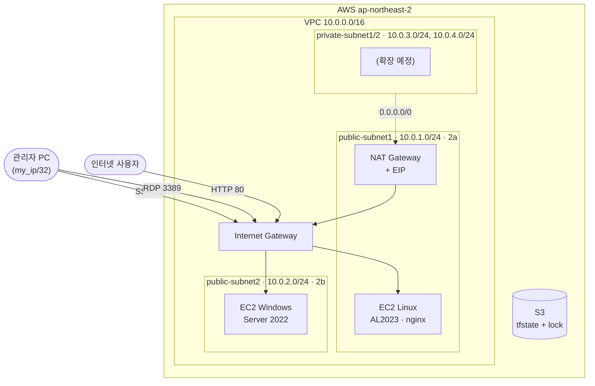

# AWS Lab: Terraform으로 구축한 AWS 인프라와 장애 대응 실습

Terraform으로 서울 리전에 VPC 네트워크와 EC2(Linux, Windows)를 코드로 구축하고,
그 위에서 **실무에서 자주 발생하는 서버 장애를 재현해 원인을 추적하고 해결한 과정**을 문서로 기록한 저장소입니다.


## 구성도



## 기술 스택

| 분류 | 사용 기술 |
|---|---|
| IaC | Terraform ≥ 1.10, AWS Provider ~> 6.66 |
| State 관리 | S3 원격 백엔드 + S3 네이티브 잠금(`use_lockfile`) |
| 네트워크 | VPC, 퍼블릭/프라이빗 서브넷(2 AZ), IGW, NAT Gateway, 라우팅 테이블 |
| 컴퓨팅 | EC2 Amazon Linux 2023, Windows Server 2022 |
| 웹 서버 | nginx (`user_data`로 부팅 시 자동 설치) |
| 운영 | systemd, journalctl, nginx 로그 분석, Linux 권한 관리 |

## 설계 포인트

- **관리 포트 최소 개방:** SSH(22)와 RDP(3389)는 `my_ip` 변수의 `/32` 대역만 허용합니다. 변수 `validation`으로 `/32`가 아닌 값은 막습니다. HTTP(80)만 전체에 공개합니다.
- **민감 정보 분리:**
  - 내 IP는 `terraform.tfvars`에 두고 `.gitignore`로 제외합니다.
  - Windows 키는 로컬에서 `ssh-keygen`으로 만들고 **공개키만** 등록합니다.
  - Windows 관리자 비밀번호는 state에 남지 않도록 로컬 AWS CLI로 복호화합니다.
- **인스턴스 보안 기본값:** IMDSv2 강제(`http_tokens = "required"`), 루트 볼륨 gp3 암호화를 적용했습니다.
- **재생성 안정성:**
  - AMI는 AWS 공식 SSM 파라미터로 최신 이미지를 조회합니다.
  - `ignore_changes = [ami]`로 새 AMI가 나와도 인스턴스가 다시 만들어지지 않게 했습니다.
- **리팩터링 안전성:** 리소스 이름을 바꿀 때 `moved` 블록을 써서, 리소스를 지우고 다시 만들지 않고 state 주소만 옮겼습니다.
- **비용 관리:** 실습이 끝나면 `terraform destroy`로 NAT Gateway를 포함한 전체를 정리하고, 다음 날 `apply`로 같은 환경을 복원합니다.

## 장애 대응 실습 (Troubleshooting)

Linux EC2에 장애를 일부러 발생시키고, **증상만 보고** 원인을 찾아 해결했습니다.
각 문서는 **상황 → 증상 → 로그 분석 → 원인 → 조치 → 재발 방지** 순서로 작성한 장애 보고서(포스트모템) 형식입니다.

| # | 장애 | 핵심 원인 | 사용한 도구 |
|---|---|---|---|
| 1 | [서버에 파일이 저장되지 않음](troubleshooting/01-disk-full.md) | 앱 디버그 로그가 디스크 100% 점유 | `df`, `du`, `truncate`, logrotate |
| 2 | [설정 변경 후 웹사이트 접속 불가](troubleshooting/02-config-syntax.md) | nginx 설정 `;` 누락 + 검사 없이 restart | `journalctl`, `nginx -t`, `reload` vs `restart` |
| 3 | [배포 후 403 Forbidden](troubleshooting/03-permission.md) | `mv`로 600 권한이 그대로 따라옴 | error/access log, `ls -l`, `ps`, `install` |
| 4 | [야간 점검 후 홈페이지가 이상한 페이지로 바뀜](troubleshooting/04-port-conflict.md) | 다른 웹 서버(Apache)가 80번 포트 선점 | `ss -tlnp`, `dnf history`, `systemctl disable`, 재부팅 검증 |
| 5 | [서버는 정상인데 외부에서 접속 불가](troubleshooting/05-network.md) | 보안 그룹을 Terraform 밖에서 수정 (drift) | `Test-NetConnection`, `tcpdump`, `terraform plan/apply`, CloudTrail |
| 6 | [정기 재부팅 후 웹 서버가 켜지지 않음](troubleshooting/06-boot.md) | 로그 폴더를 재부팅 시 비워지는 `/run`(tmpfs)에 둠 | `journalctl -b -1`, `findmnt`, `df`, 재부팅 검증 |

전체 목록과 진행 방법: [troubleshooting/README.md](troubleshooting/README.md)

> 장애 시나리오는 AI 도구(Claude Code)로 만들어 실습 서버에 발생시켰습니다. 진단과 해결은 제가 직접 서버에 접속해 수행했습니다.

## 디렉터리 구조

```
.
├── backend.tf            # S3 원격 state + 잠금
├── terraform.tf          # Terraform, Provider 버전 고정
├── main.tf               # AWS provider (ap-northeast-2)
├── variables.tf          # my_ip(검증 포함), 인스턴스 타입
├── vpc.tf                # VPC, 퍼블릭/프라이빗 서브넷 x2
├── IGW.tf / route.tf     # 인터넷 게이트웨이, 퍼블릭 라우팅
├── nat.tf                # NAT Gateway, 프라이빗 라우팅
├── security_group.tf     # Linux(SSH/HTTP), Windows(RDP/HTTP) 보안 그룹
├── ec2_linux.tf          # Amazon Linux 2023 + nginx user_data
├── ec2_windows.tf        # Windows Server 2022 + 키 페어
├── outputs.tf            # 접속 IP, SSH 명령, Windows 비밀번호 조회 명령
├── moved.tf              # 리소스 이름 변경 이력
├── keys/windows.pub      # Windows 키 페어 공개키 (개인키는 저장소에 없음)
├── docs/
│   ├── resources.md      # 리소스별 역할과 참조 관계 설명
│   └── next-labs.md      # 다음 실습 계획 (Ansible 등)
└── troubleshooting/      # 장애 대응 보고서와 캡처 이미지
```

## 실행 방법

사전 준비: Terraform ≥ 1.10, AWS CLI 인증, state용 S3 버킷, Linux용 EC2 키 페어(`linux`)

```bash
# 1. 내 공인 IP 설정 (반드시 /32)
echo 'my_ip = "x.x.x.x/32"' > terraform.tfvars

# 2. Windows용 키 생성 (개인키는 저장소 밖에 보관)
ssh-keygen -t rsa -b 4096 -m PEM -N "" -f ~/windows.pem
cp ~/windows.pem.pub keys/windows.pub

# 3. 배포
terraform init
terraform plan
terraform apply

# 4. 접속 정보 확인
terraform output

# 5. 실습 종료 후 정리 (NAT Gateway 과금 방지)
terraform destroy
```

## 개선 예정

- [ ] 웹 서버를 프라이빗 서브넷으로 옮기고 ALB 뒤에 배치 (현재 프라이빗 서브넷과 NAT는 확장용으로만 만들어져 있음)
- [ ] Ansible로 nginx 구성 자동화 (`validate: nginx -t -c %s` 적용)
- [ ] CloudWatch Agent와 디스크 사용률 알람 (장애 #1 재발 방지)
- [ ] GitHub Actions로 `terraform fmt`, `validate`, `plan` 자동 실행
- [ ] 장애 대응 실습 6 (재부팅 후 서비스 미기동)
- [ ] root 액세스 키 대신 IAM 사용자 / IAM Identity Center 사용 (장애 #5에서 발견)
