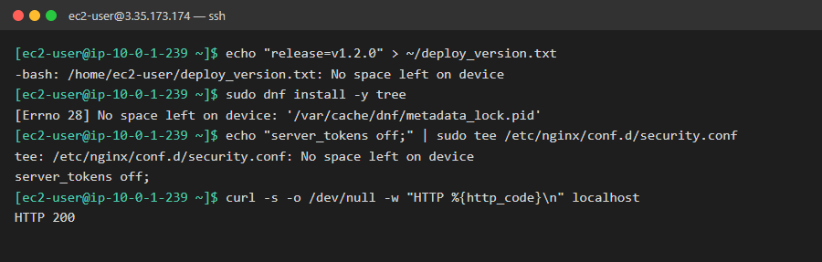
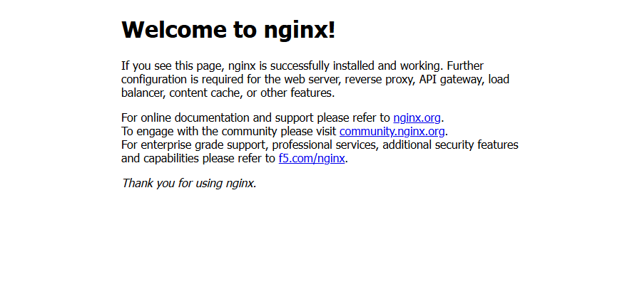
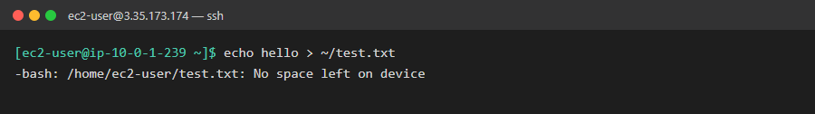
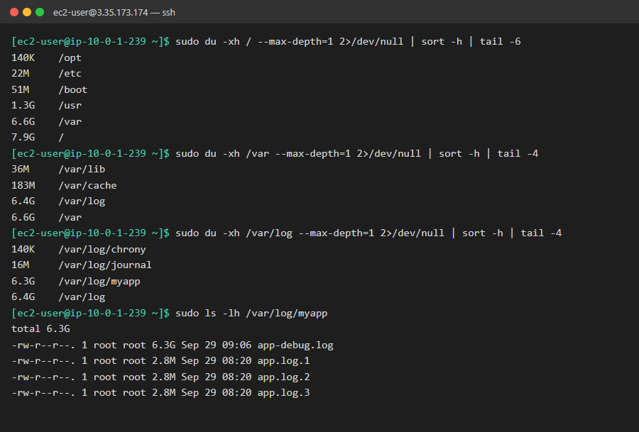
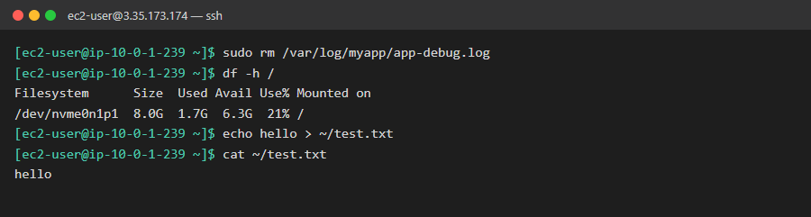

# 01. 서버에 파일이 저장되지 않음

| 항목 | 내용 |
|---|---|
| 대상 서버 | `linux-ec2` (3.35.173.174, Amazon Linux 2023) |
| 발생 시각 | 2026-09-29 17:20 KST |
| 영향 | 배포, 설정 변경, 패키지 설치 불가 |
| 상태 | 🟢 해결 (2026-09-29 18:02 KST) |

## 상황

> 개발팀 문의:
> "오늘 배포하려는데 배포 스크립트가 계속 실패합니다. 서버에 버전 파일을 쓰는 단계에서 에러가 나요.
> 인프라팀에서 nginx 보안 설정도 추가하려 했는데 저장이 안 된다고 하네요.
> 그런데 웹사이트는 정상적으로 잘 열립니다. 서버에 무슨 문제가 있는 건가요?"

## 증상

**터미널: 파일 쓰기, 패키지 설치, 설정 저장이 모두 실패**



**브라우저: 웹사이트는 정상 (http://3.35.173.174)**



## 목표

- [x] 원인 찾기: 무엇이, 어디서 문제를 일으키는지
- [x] 서비스 정상화: 위 증상의 명령이 모두 성공해야 함
- [ ] 재발 방지: 같은 일이 다시 생기지 않도록 조치 (심화)

## 힌트

<details>
<summary>힌트 1: 에러 메시지를 그대로 읽어보기</summary>

세 명령의 에러 메시지에 공통으로 들어간 문구가 있습니다. 그 문구가 무슨 뜻인지부터 확인하세요.
</details>

<details>
<summary>힌트 2: 전체 현황 확인</summary>

파일시스템별 용량을 사람이 읽기 쉬운 단위로 보여주는 명령이 있습니다. `d`로 시작하는 두 글자 명령이에요.
</details>

<details>
<summary>힌트 3: 범인 찾기</summary>

`du -sh <디렉터리>/*`로 하위 폴더의 크기를 볼 수 있습니다. `/`부터 시작해서 가장 큰 폴더로 한 단계씩 내려가세요. `sort -h`를 붙이면 크기순으로 정렬됩니다. 권한 에러를 피하려면 `sudo`를 붙이세요.
</details>

<details>
<summary>힌트 4: 지우기 전에 생각하기</summary>

찾은 파일이 무엇인지, 지워도 되는지 먼저 판단하세요. 실무에서는 로그를 무작정 지우지 않습니다.
- 내용을 확인할 때는 `head`, `tail`을 씁니다. 큰 파일을 `cat`으로 열면 안 됩니다.
- 파일을 지우지 않고 비우는 방법(`truncate`)도 있습니다.
</details>

<details>
<summary>힌트 5: 재발 방지 (심화)</summary>

로그 파일을 날짜나 크기 기준으로 자동으로 나누고 오래된 것을 지워주는 도구가 이미 설치돼 있습니다. `/etc/logrotate.d/`를 살펴보세요.
</details>

## 생각해볼 점

- 디스크가 꽉 찼는데 웹사이트는 왜 정상으로 열렸을까요?
- 실무에서는 **파일을 지웠는데도 용량이 줄지 않는** 경우가 있습니다. 어떤 상황에서 그럴까요? (키워드: `lsof`, deleted)
- 디스크가 90%를 넘었을 때 미리 알 수 있었다면? AWS에서는 어떤 서비스로 알림을 받을 수 있을까요?

## 해결 기록

> 아래 캡처는 해결 후 같은 장애 상태를 다시 만들고, 실제로 사용한 명령을 순서대로 실행해 찍은 것입니다.
> 화면에 맞추려고 `du` 결과에는 `| tail -N`을 붙여 큰 항목만 표시했습니다.

### 요약

| 항목 | 내용 |
|---|---|
| **원인** | `/var/log/myapp/app-debug.log`(6.3GB)가 계속 커져서 루트 디스크(8GB)를 100% 채움 |
| **영향** | 새 파일 생성 불가 → 배포, 설정 변경, 패키지 설치 실패. 이미 떠 있는 nginx는 파일을 읽기만 해서 웹은 정상 |
| **조치** | 디버그 로그 파일 삭제 → 디스크 사용률 100% → 21% |
| **재발 방지** | 미완료 (아래 참고) |

### 1단계. 증상 재현: 디스크 문제인지 확인

가장 간단한 쓰기 작업으로 증상을 재현했습니다. `No space left on device`는 **디스크 공간이 없다**는 뜻입니다.

```bash
echo hello > ~/test.txt
```



### 2단계. 원인 찾기: 큰 디렉터리를 따라 내려가기

`du`로 `/`부터 하위 디렉터리 크기를 보고, **가장 큰 곳으로 한 단계씩** 내려갔습니다.
`/` → `/var`(6.6G) → `/var/log`(6.4G) → `/var/log/myapp`(6.3G) → `app-debug.log`(6.3G)

```bash
sudo du -xh / --max-depth=1 2>/dev/null | sort -h
```

| 옵션 | 의미 |
|---|---|
| `-x` | 다른 파일시스템(`/proc`, `/dev` 등)으로 넘어가지 않음 → 루트 디스크만 계산 |
| `-h` | 사람이 읽기 쉬운 단위 (K, M, G) |
| `--max-depth=1` | 바로 아래 한 단계까지만 합계 표시 |
| `2>/dev/null` | 권한 에러 메시지 숨김 |
| `sort -h` | 크기 단위를 이해해서 정렬 → 가장 큰 항목이 맨 아래 |



### 3~5단계. 파일 삭제 후 복구 확인

```bash
sudo rm /var/log/myapp/app-debug.log   # 3. 원인 파일 삭제
df -h /                                # 4. 사용률 재확인: 100% → 21%
echo hello > ~/test.txt                # 5. 1단계의 명령을 다시 실행해서 정상 확인
cat ~/test.txt
```



### 리뷰: 실무라면 더 챙길 점

- **삭제 범위:** 실습에서는 `app-debug.log`와 함께 현재 로그인 `app.log`도 지워졌습니다. 실무에서는 문제의 원인인 파일만 정리하고, 앱이 지금 쓰고 있는 로그는 남겨두는 게 안전합니다. 장애 원인을 분석할 때 필요할 수 있습니다.
- **`rm` 대신 `truncate`:** 앱이 파일을 열어둔 채 쓰고 있으면, `rm`으로 지워도 **앱이 파일을 닫을 때까지 용량이 돌아오지 않습니다.** 이럴 때는 파일을 비우는 게 안전합니다.
  ```bash
  sudo truncate -s 0 /var/log/myapp/app-debug.log
  sudo lsof +L1    # 지워졌는데 아직 열려 있는 파일(deleted) 확인
  ```
- **먼저 알리기:** 삭제 전에 개발팀에 "디버그 로그가 6GB라 정리합니다"라고 공유하고, 필요하면 일부를 백업합니다. 예: `tail -n 1000 app-debug.log > /tmp/debug-tail.log`

### 재발 방지 (미완료)

로그가 무한히 커지지 않도록 `logrotate` 설정을 추가하면 됩니다. 현재 `/etc/logrotate.d/`에는 myapp 설정이 없습니다.

```bash
sudo tee /etc/logrotate.d/myapp <<'CONF'
/var/log/myapp/*.log {
    daily
    rotate 7
    maxsize 100M
    compress
    missingok
    notifempty
    copytruncate
}
CONF
sudo logrotate -d /etc/logrotate.d/myapp   # 문법 확인 (실제로 실행되지는 않음)
```

모니터링도 추가하면 좋습니다. CloudWatch Agent로 디스크 사용률을 수집하고, 80%가 넘으면 CloudWatch 알람으로 알림을 받습니다.

### 생각해볼 점: 답

- **웹은 왜 정상이었나?** nginx는 이미 실행 중이었고 정적 파일을 **읽기만** 해서 영향이 없었습니다. 접속 로그는 쓰지 못했지만 응답에는 영향이 없었습니다. "웹이 뜬다 = 서버 정상"은 아닙니다.
- **지웠는데 용량이 안 줄어드는 경우:** 프로세스가 파일을 열어둔 상태라서 그렇습니다. `lsof +L1`로 찾아서 해당 서비스를 재시작하거나, 처음부터 `truncate`를 씁니다.
- **미리 알 수 있는 방법:** CloudWatch Agent와 CloudWatch Alarm(`disk_used_percent`)을 쓰고, SNS로 메일이나 Slack 알림을 받습니다.
