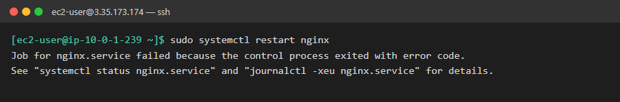
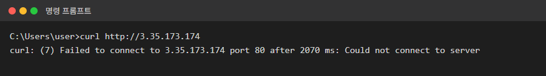
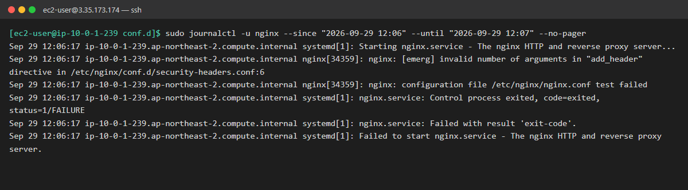
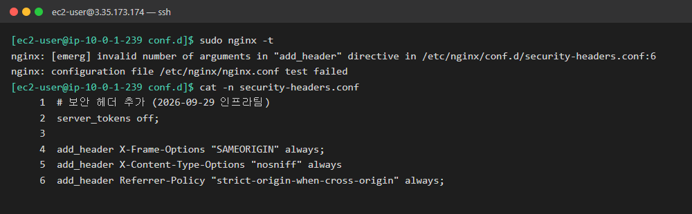
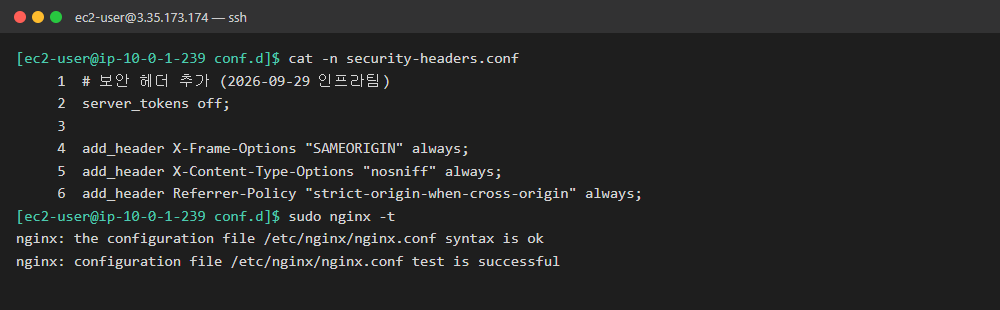
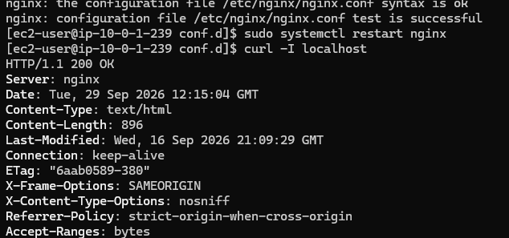

# 02. 설정 변경 후 웹사이트 접속 불가

| 항목 | 내용 |
|---|---|
| 대상 서버 | `linux-ec2` (3.35.173.174, Amazon Linux 2023) |
| 발생 시각 | 2026-09-29 18:12 KST |
| 영향 | 웹사이트 전체 접속 불가 (서비스 중단) |
| 상태 | 🟢 해결 (2026-09-29 21:15 KST) |

## 상황

> 인프라팀 동료가 퇴근하면서 남긴 메시지:
> "보안 점검에서 지적받은 HTTP 보안 헤더 설정을 추가했어요. 적용하려고 nginx를 재시작했는데 에러가 나네요.
> 급한 일이 있어서 먼저 들어갑니다. 😢"
>
> 10분 뒤 고객센터 문의:
> "홈페이지가 아예 안 열려요!"

## 증상

**서버: nginx 재시작 실패**



**내 PC: 웹사이트 접속 불가**



## 목표

- [x] 원인 찾기: 어떤 파일의 어디가 잘못됐는지
- [x] 서비스 정상화: http://3.35.173.174 가 다시 열려야 함
- [x] 동료의 의도대로 보안 헤더가 **적용된 상태**로 복구 (설정을 지워서 해결하면 절반만 성공)
- [x] 재발 방지: 다음부터 같은 실수로 서비스가 죽지 않게 하는 작업 순서 정리 (심화)

## 힌트

<details>
<summary>힌트 1: 에러 메시지가 알려주는 곳 보기</summary>

재시작 실패 메시지에 **자세한 내용을 볼 수 있는 명령어 두 개**가 적혀 있습니다. 그대로 실행해 보세요.
</details>

<details>
<summary>힌트 2: 설정 파일 검사하기</summary>

nginx에는 서비스를 재시작하지 않고 **설정 파일 문법만 검사하는** 옵션이 있습니다. `sudo nginx -?`로 옵션 목록을 보세요.
</details>

<details>
<summary>힌트 3: 줄 번호에 속지 않기</summary>

에러가 가리키는 줄 자체에는 문제가 없어 보일 수 있습니다. 설정 파일은 **문장 끝을 알리는 기호**로 명령을 구분합니다. 그 기호가 빠지면 nginx는 다음 줄까지 한 문장으로 읽습니다. **바로 윗줄**을 보세요.
</details>

<details>
<summary>힌트 4: 고친 뒤 확인 순서</summary>

1. 검사 명령으로 `test is successful` 확인
2. 서비스 재시작, 상태 확인
3. 헤더가 실제로 붙었는지 확인: `curl -I localhost`
</details>

## 생각해볼 점

- 에러 줄 번호와 실제 실수한 줄이 다른 이유는?
- `restart` 대신 `reload`를 썼다면 서비스가 죽었을까요? 둘의 차이는?
- 동료가 설정을 바꾸기 전에 무엇을 했으면 이 장애를 막을 수 있었을까요?

## 해결 기록

> 1~3단계 캡처는 해결 후에 찍었습니다.
> - 1단계 로그: 조사 중 재시작했을 때 남은 **실제 journal 기록**입니다. 시각은 UTC라서 한국 시간보다 9시간 느립니다.
> - 2단계: 설정 **파일에서만** `;`를 잠시 다시 빼고 찍었습니다. nginx는 재시작하지 않아서 서비스는 멈추지 않았습니다.
> - 4단계: 해결 직후 직접 찍은 화면입니다.

### 작성자 기록

| 항목 | 내용 |
|---|---|
| **원인** | nginx의 `security-headers.conf` 파일에서 세미콜론(`;`)이 빠져서 인자가 과도하게 읽힘 |
| **확인한 명령어** | `sudo systemctl restart nginx` 실패 메시지가 안내한 `journalctl -xeu nginx.service`로 로그를 자세히 확인 |
| **조치 내용** | failed 부분을 찾아서 에러가 난 파일 경로와 파일명 확인 → `cat`으로 내부 확인 → 원인 파악 후 `nano`로 수정 |
| **재발 방지** | ① 수정 전 백업(`cp 파일 파일.bak`) ② 적용 전 문법 검사 `nginx -t` ③ 적용은 `restart` 대신 `reload`, 검사 통과 시에만 실행: `sudo nginx -t && sudo systemctl reload nginx` ④ 적용이 실패하면 백업으로 원상복구한 뒤 인수인계 ⑤ 장기적으로는 Ansible 배포 시 `validate: nginx -t -c %s`로 틀린 설정이 서버에 올라가지 않게 막기 (자세한 내용은 아래 [재발 방지](#재발-방지) 참고) |
| **배운 점** | 디버깅할 때 명령어와 에러 메시지를 더 세세하게 보게 됨. 원인을 파악하고, 안쪽으로 한 단계씩 내려가면서 해결하는 자세를 배움 |

### 요약

| 항목 | 내용 |
|---|---|
| **원인** | `/etc/nginx/conf.d/security-headers.conf` **5번 줄 끝에 `;` 누락** |
| **왜 죽었나** | 설정을 검사하지 않고 `restart` → 새 설정 로딩 실패 → nginx가 중지된 상태로 남음 |
| **조치** | nano로 `;` 추가 → `nginx -t` 검사 → `restart` |
| **결과** | 웹 복구 + 보안 헤더 3개 모두 적용됨 (설정을 지우지 않고 살림) |

### 1단계. 로그에서 원인 찾기

`systemctl restart` 실패 메시지가 알려준 `journalctl -xeu nginx.service`를 실행했습니다.

처음에는 `nginx.service: Failed with result 'exit-code'` 줄에 눈이 갔습니다. 하지만 이 줄은 **systemd가 남긴 "실패했다"는 결과**일 뿐입니다. 원인은 그 위에 **nginx가 직접 남긴 `[emerg]` 줄**에 있습니다.

| 로그 앞부분 | 누가 남겼나 | 알 수 있는 것 |
|---|---|---|
| `systemd[1]:` | 서비스 관리자 | 실패했다는 **결과** |
| `nginx[34359]:` | nginx 자신 | 실패한 **원인** |



> 💡 `journalctl`은 긴 줄을 화면 폭에 맞춰 자르고 끝에 `>`를 표시합니다. 이번에도 파일 이름 뒤쪽이 잘려 있었습니다. `--no-pager`를 붙이면 줄이 잘리지 않고, 방향키 `→`로 옆으로 스크롤해도 됩니다.

### 2단계. 파일과 줄 찾기

`nginx -t`는 서비스를 건드리지 않고 **설정 문법만 검사**합니다. 파일 이름과 줄 번호(`:6`)가 잘리지 않고 나옵니다.
`cat -n`으로 줄 번호를 붙여서 파일을 열었습니다.

```bash
sudo nginx -t
cat -n /etc/nginx/conf.d/security-headers.conf
```



**에러는 6번 줄을 가리키지만 실제 실수는 5번 줄입니다.** nginx는 `;`가 나올 때까지를 한 문장으로 읽습니다. 5번 줄에 `;`가 없으니 5~6번 줄을 합쳐서 읽었습니다.
```nginx
add_header X-Content-Type-Options "nosniff" always add_header Referrer-Policy "..." always;
```
그 결과 `add_header`에 인자가 너무 많아졌고(`invalid number of arguments`), 에러는 문장이 끝난 6번 줄에서 보고됐습니다.

### 3단계. 수정 후 검사

```bash
sudo nano -l /etc/nginx/conf.d/security-headers.conf   # 5번 줄 끝에 ; 추가, Ctrl+O 저장, Ctrl+X 종료
sudo nginx -t                                          # 재시작 전에 반드시 검사
```



### 4단계. 재시작 후 확인

```bash
sudo systemctl restart nginx
curl -I localhost
```



- `HTTP/1.1 200 OK`: 웹 정상
- `X-Frame-Options`, `X-Content-Type-Options`, `Referrer-Policy`: 동료가 넣으려던 보안 헤더 3개 모두 적용
- `Server: nginx`: 버전 번호가 사라짐. 2번 줄의 `server_tokens off;`도 적용됐다는 뜻입니다.

### 재발 방지

설정을 바꿀 때는 **검사를 통과해야만 적용되도록** 순서를 고정합니다.

```bash
sudo cp security-headers.conf security-headers.conf.bak   # 1. 수정 전 백업
sudo nano security-headers.conf                           # 2. 수정
sudo nginx -t && sudo systemctl reload nginx              # 3. 검사 통과 시에만 reload
```

- `&&`: 앞 명령이 **성공했을 때만** 뒤 명령을 실행합니다. 검사가 실패하면 reload 자체가 실행되지 않습니다.
- `reload`를 쓰는 이유는 아래 "생각해볼 점"을 참고하세요.
- 나중에 Ansible로 설정을 배포할 때도 같은 원칙을 적용할 수 있습니다. `template` 모듈의 `validate: nginx -t -c %s` 옵션을 쓰면 검사에 실패한 설정 파일은 서버에 올라가지 않습니다.

### 생각해볼 점: 답

- **줄 번호가 다른 이유:** nginx는 줄바꿈이 아니라 `;`로 문장을 구분합니다. `;`가 빠지면 다음 줄까지 이어서 읽고, 문장이 끝난 곳의 줄 번호를 보고합니다. 에러 줄에 문제가 안 보이면 **바로 윗줄 끝**을 먼저 봅니다. C, Java 같은 언어에서도 똑같이 적용되는 습관입니다.
- **`restart`와 `reload`의 차이:**
  | | restart | reload |
  |---|---|---|
  | 동작 | 완전히 끄고 다시 켬 | 켜진 상태에서 새 설정만 다시 읽음 |
  | 설정이 틀렸을 때 | 끈 뒤 켜지 못해서 **서비스 중단** | 새 설정을 거부하고 **기존 설정으로 계속 동작** |
  | 접속 중인 사용자 | 연결이 끊김 | 끊기지 않음 |

  동료가 `reload`를 썼다면 에러는 났겠지만 웹사이트는 계속 떠 있었을 겁니다.
- **동료가 했어야 할 것:** `nginx -t`로 먼저 검사하기, 수정 전 백업하기, `reload` 쓰기. 그리고 적용이 실패했다면 **원래대로 되돌려 놓고 퇴근하기**(원상복구 후 인수인계).
