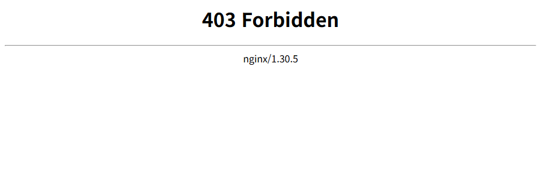
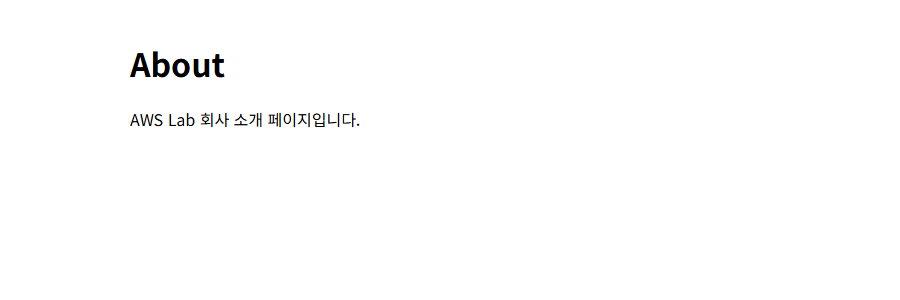
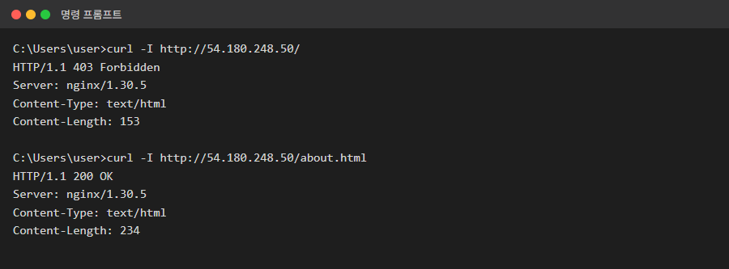
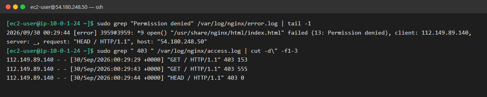
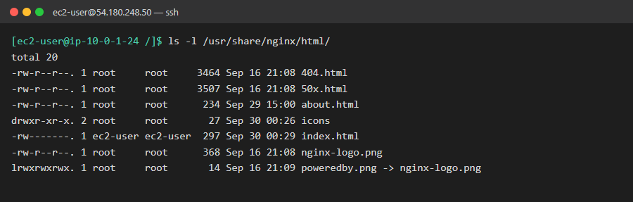
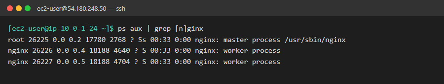
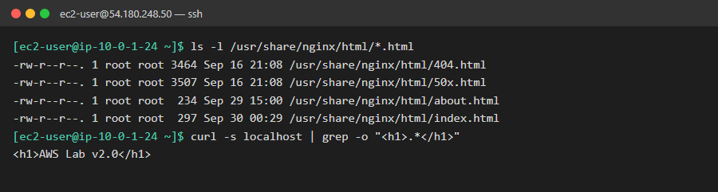

# 03. 새 메인 페이지 배포 후 403 Forbidden

| 항목 | 내용 |
|---|---|
| 대상 서버 | `linux-ec2` (54.180.248.50, Amazon Linux 2023) |
| 발생 시각 | 2026-09-30 09:29 KST |
| 영향 | 메인 페이지 접속 불가 (다른 페이지는 정상) |
| 상태 | 🟢 해결 (2026-09-30 09:50 KST) |

## 상황

> 개발팀 문의:
> "오늘 아침에 가을 이벤트용 새 메인 페이지를 배포했어요. 홈 폴더에서 `index.html`을 만들고 `sudo mv`로 웹 폴더에 옮겼습니다.
> 그런데 메인에 들어가면 **403 Forbidden**이 떠요. 어제 올린 회사 소개 페이지는 잘 열리고요.
> 파일은 분명히 거기 있는데 왜 금지라고 나오죠? 이벤트가 오늘 오전 10시 시작이라 급합니다!"

## 증상

**브라우저: 메인 페이지 (http://54.180.248.50/)**



**브라우저: 회사 소개 페이지 (http://54.180.248.50/about.html)**



**내 PC: 두 페이지 응답 비교**



## 목표

- [x] 원인 찾기: 같은 폴더의 두 파일이 왜 다르게 동작하는지
- [x] 서비스 정상화: 메인 페이지에 "AWS Lab v2.0"이 떠야 함
- [x] **최소 권한으로 고치기:** 같은 폴더의 다른 파일들과 소유자, 권한을 맞추기. `chmod 777`로 해결하면 절반만 성공
- [x] 재발 방지: 다음 배포 때 같은 일이 안 생기는 배포 방법 정리 (심화)

## 힌트

<details>
<summary>힌트 1: 403의 의미</summary>

404(Not Found)는 "파일이 없다", 403(Forbidden)은 "파일은 있지만 **보여줄 수 없다**"는 뜻입니다. 서버가 왜 보여줄 수 없었는지는 nginx의 **에러 로그**에 남습니다. 로그 폴더는 1번 시나리오에서 `/var/log` 아래를 둘러봤을 때 본 적이 있습니다.
</details>

<details>
<summary>힌트 2: 두 파일 비교하기</summary>

웹 폴더(`/usr/share/nginx/html`)에서 `ls -l`로 `index.html`과 `about.html`의 **앞쪽 10글자**와 **소유자** 칸을 비교해 보세요.
</details>

<details>
<summary>힌트 3: nginx는 누구로 실행되나</summary>

파일을 읽는 주체는 여러분이 아니라 **nginx 프로세스**입니다. `ps aux | grep nginx`로 nginx가 어떤 사용자로 실행되는지 확인하고, 그 사용자 입장에서 `index.html`을 읽을 수 있는지 생각해 보세요.

`-rw-------` 읽는 법: `[파일종류][소유자 rwx][그룹 rwx][기타 rwx]`
</details>

<details>
<summary>힌트 4: 고치는 명령어</summary>

- 권한 변경: `chmod` (숫자로 쓰면 r=4, w=2, x=1)
- 소유자 변경: `chown 사용자:그룹 파일`
- 둘 다 root 파일이므로 `sudo`가 필요합니다.
</details>

<details>
<summary>힌트 5: 왜 mv에서 문제가 생겼나 (재발 방지)</summary>

`mv`와 `cp`는 권한과 소유자를 다루는 방식이 다릅니다. 홈 폴더에서 테스트 파일을 만들어 각각 옮겨 보고 `ls -l`로 비교해 보세요. `install` 명령어도 찾아보세요.
</details>

## 생각해볼 점

- 에러 로그의 `(13: Permission denied)`에서 13은 무엇일까요?
- `chmod 777`로도 페이지는 뜹니다. 그런데 왜 실무에서는 하면 안 될까요?
- `ls -l` 결과 권한 뒤에 붙은 점(`.`)은 무엇일까요? (예: `-rw-r--r--.`)

## 해결 기록

> 캡처는 장애를 다시 만들지 않고 찍었습니다.
> - 1단계 로그: 서버에 남아 있는 실제 기록입니다. 시각은 UTC입니다.
> - 2단계 `ls -l`: 조사하면서 실제로 실행한 출력입니다.
> - 3~4단계: 해결 후 서버 상태입니다.
> - access.log에 찍힌 403 3건은 증상 캡처용 요청(브라우저, curl)입니다.

### 작성자 기록

| 항목 | 내용 |
|---|---|
| **원인** | 홈 폴더에서 `600`(`-rw-------`), `ec2-user` 소유로 만든 `index.html`을 `sudo mv`로 옮겨서 권한과 소유자가 그대로 따라옴. nginx worker(`nginx` 사용자)는 "기타 사용자"에 해당해서 읽기 권한이 없음 |
| **확인한 명령어** | `sudo tail -20 /var/log/nginx/error.log` → `(13: Permission denied)` 확인. `access.log`로 403 기록 확인. `ls -l`로 `about.html`과 비교. `ps aux`로 nginx 실행 사용자 확인 |
| **조치 내용** | `sudo chmod 644 index.html`, `sudo chown root:root index.html` → 같은 폴더의 다른 파일과 동일하게 맞춤 |
| **재발 방지** | 배포할 때 `mv` 대신 `install -m 644 -o root -g root`로 권한과 소유자를 명시. 배포 후 `ls -l`과 `curl -I`로 확인 |
| **배운 점** | 파일을 **읽는 주체(nginx)가 누구인지** 먼저 확인하고, 그 입장에서 `ls -l`로 권한을 봐야 함. 로그는 "권한이 없다"까지만 알려주고, **왜 없는지**는 파일을 직접 확인해야 함 |

### 1단계. 로그로 원인 종류 파악

```bash
sudo tail -20 /var/log/nginx/error.log         # 왜 실패했나
sudo grep ' 403 ' /var/log/nginx/access.log    # 언제, 몇 번 실패했나
```



`open() "/usr/share/nginx/html/index.html" failed (13: Permission denied)`: nginx가 파일을 **열려고 했는데 운영체제가 막음**. 여기까지는 "권한 문제"라는 것만 확정됩니다.

### 2단계. 정상 파일과 비교

```bash
ls -l /usr/share/nginx/html/
```



| | about.html (정상) | index.html (403) |
|---|---|---|
| 권한 | `-rw-r--r--` (644) | `-rw-------` (600) |
| 소유자:그룹 | `root:root` | `ec2-user:ec2-user` |
| **기타 사용자** | `r--` 읽기 가능 | `---` **읽기 불가** |

### 3단계. 파일을 읽는 주체 확인

```bash
ps aux | grep [n]ginx
```



- `master process`(root): 설정을 읽고 worker를 관리합니다. 요청은 처리하지 않습니다.
- `worker process`(**nginx**): **실제로 요청을 받아 파일을 읽습니다.**
- `nginx` 사용자는 `index.html`의 소유자(`ec2-user`)도, 그룹(`ec2-user`)도 아닙니다. 그래서 **기타 사용자** 권한 `---`가 적용됩니다. → **Permission denied**

> 💡 `grep [n]ginx`처럼 첫 글자를 `[]`로 감싸면 `grep` 명령 자신이 결과에 섞이지 않습니다.

### 4단계. 조치 및 확인

```bash
cd /usr/share/nginx/html
sudo chmod 644 index.html          # rw-r--r--: 기타 사용자에게 읽기만 허용
sudo chown root:root index.html    # 다른 파일처럼 root가 관리
ls -l *.html
curl -s localhost | grep -o "<h1>.*</h1>"
```



> 💡 파일 권한 변경은 **nginx 재시작 없이 바로 반영됩니다.** nginx는 요청이 올 때마다 파일을 새로 열기 때문입니다.

### 생각해볼 점: 답

- **13의 의미:** 리눅스 에러 번호 `EACCES`(Permission denied)입니다. 1번 시나리오의 `Errno 28`은 `ENOSPC`(No space left on device), 이번 error.log의 `favicon.ico` 줄에 나온 `(2: No such file or directory)`는 `ENOENT`입니다. 같은 번호는 어떤 프로그램에서 나와도 같은 뜻입니다.
- **`chmod 777`을 하면 안 되는 이유:** 모든 사용자에게 **쓰기와 실행**까지 열립니다. 서버에 침투한 공격자가 다른 계정으로도 메인 페이지를 바꿀 수 있게 됩니다(웹 변조). nginx에 필요한 건 **읽기(r) 하나뿐**입니다. 필요한 만큼만 주는 게 **최소 권한 원칙**입니다.
- **권한 뒤의 점(`.`):** 그 파일에 **SELinux 보안 라벨**이 붙어 있다는 표시입니다. `ls -Z`로 볼 수 있습니다. 지금 서버는 SELinux가 Permissive라서 영향이 없었지만, Enforcing 서버라면 `mv`로 옮긴 파일은 라벨 때문에 `644`여도 403이 날 수 있습니다. 이때는 `sudo restorecon -v 파일`로 고칩니다.

## 정리: 지금까지 나온 헷갈리는 개념 비교

### 1. 상황별 조사 명령어

| 알고 싶은 것 | 명령어 | 나온 시나리오 |
|---|---|---|
| 디스크가 얼마나 찼나 | `df -h` | 1번 |
| 무엇이 디스크를 차지하나 | `du -xh --max-depth=1 \| sort -h` | 1번 |
| 서비스가 **왜 안 켜지나** | `journalctl -u 서비스명` | 2번 |
| 설정 파일이 맞나 | `nginx -t` | 2번 |
| 서비스는 켜져 있는데 **요청이 왜 실패하나** | 프로그램의 로그 파일 (`/var/log/nginx/error.log`) | 3번 |
| 파일 권한과 소유자 | `ls -l` | 3번 |
| 프로세스가 누구로 실행되나 | `ps aux` | 3번 |

### 2. journalctl vs 프로그램 로그 파일

| | journalctl | /var/log/nginx/*.log |
|---|---|---|
| 기록하는 쪽 | systemd (서비스 관리자) | nginx 자신 |
| 주로 남는 내용 | 서비스 시작, 중지, **실행 실패** | **요청 처리** 중 생긴 일 |
| 언제 보나 | 서비스가 안 켜질 때 (2번) | 서비스는 켜져 있는데 일부 요청이 실패할 때 (3번) |

### 3. access.log vs error.log

| | access.log | error.log |
|---|---|---|
| 기록 대상 | **모든 요청** (성공, 실패) | **문제가 생긴 요청과 서버 에러만** |
| 알 수 있는 것 | 누가, 언제, 무엇을, 응답 코드 | **왜** 실패했는지 (파일 경로, 에러 원인) |
| 용도 | 장애 **범위** 파악 (언제부터, 몇 건) | 장애 **원인** 분석 |
| 비유 | 출입 기록부 | 사고 보고서 |

### 4. HTTP 응답 코드

| 코드 | 의미 | 이번 실습에서 |
|---|---|---|
| 200 OK | 정상 | about.html, 해결 후 메인 |
| 403 Forbidden | 파일은 **있지만** 보여줄 수 없음 | 권한 문제 (3번) |
| 404 Not Found | 파일이 **없음** | favicon.ico (장애와 무관) |
| 접속 실패 (응답 없음) | 서버 프로그램이 **안 떠 있음** | nginx 중지 (2번) |

### 5. mv vs cp vs install

| 명령 | 동작 | 소유자 | 권한 |
|---|---|---|---|
| `mv` | 이름표만 바꿈, 파일 자체는 그대로 | **원래 소유자 유지** | **원래 권한 유지** |
| `cp` (새 파일 생성) | 새 파일을 만들어 내용 복사 | 실행한 사람 (`sudo`면 root) | 원본 권한에서 umask를 뺀 값 (600이면 거의 그대로) |
| `cp` (기존 파일 덮어쓰기) | 기존 파일에 내용만 덮어씀 | **기존 파일 것 유지** | **기존 파일 것 유지** |
| `install -m 644 -o root -g root` | 새로 만들면서 **직접 지정** | 지정값 | 지정값 |

→ 배포 결과를 **항상 같게** 만들려면 `install`을 씁니다. SELinux Enforcing 서버라면 `mv`는 보안 라벨까지 가져가니 특히 주의합니다.

### 6. chmod vs chown

| | chmod | chown |
|---|---|---|
| 바꾸는 것 | **무엇을** 할 수 있나 (r, w, x) | **누구의** 파일인가 (소유자:그룹) |
| 예시 | `chmod 644 file` | `chown root:root file` |
| 숫자 계산 | r=4, w=2, x=1을 자리(소유자/그룹/기타)마다 합산 | 없음 |

### 7. 파일 소유자 vs 파일을 읽는 프로세스

- **파일 소유자:** `ls -l`의 3번째 칸 (`root`, `ec2-user`)
- **파일을 읽는 프로세스:** `ps aux`의 첫 칸 (nginx worker는 `nginx` 사용자)
- 권한 판단 순서: 프로세스 사용자가 ① 소유자인가? → 소유자 권한, ② 그룹에 속하나? → 그룹 권한, ③ 둘 다 아니면 → **기타 사용자 권한**
- 고칠 때는 파일을 nginx에게 **주는** 게 아니라, nginx가 **읽을 수만 있게** 합니다(최소 권한).

### 8. 에러 메시지를 읽는 습관 (세 번 반복된 패턴)

| 상황 | 눈에 띄는 줄 | 실제 원인이 있던 곳 |
|---|---|---|
| 2번 journalctl | `systemd: nginx.service: Failed` (결과) | 위쪽 `nginx: [emerg] ...` |
| 2번 nginx -t | 에러가 가리킨 6번 줄 | **바로 윗줄**(5번) 끝의 `;` 누락 |
| ssh 접속 실패 | 마지막 줄 `Permission denied (publickey)` | 첫 줄 `Warning: Identity file linux.pem not accessible` (실행 폴더가 달랐음) |

→ **마지막 줄은 결과, 원인은 그 위에 있습니다.** 에러가 나면 출력 전체를 위에서부터 읽습니다.
