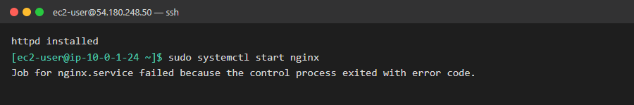
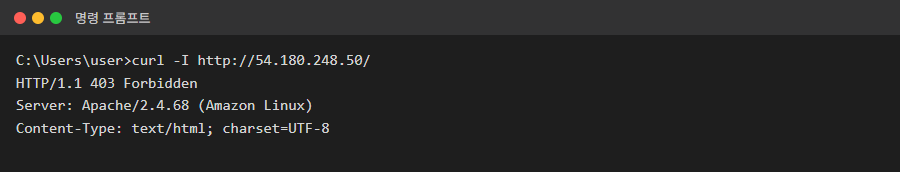
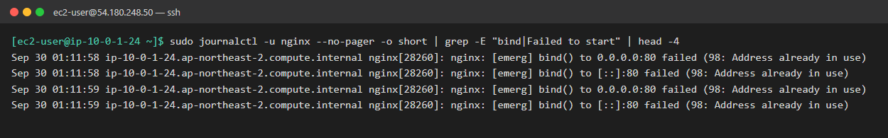
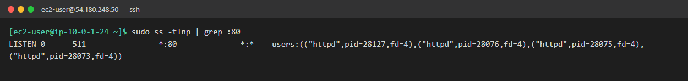
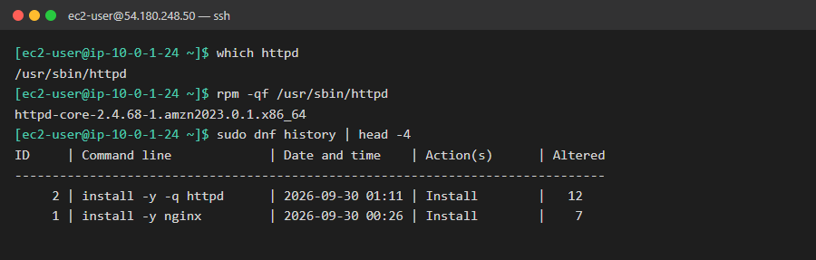
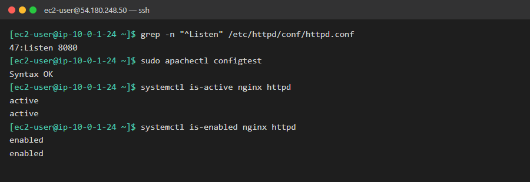
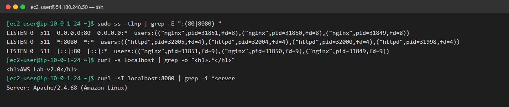
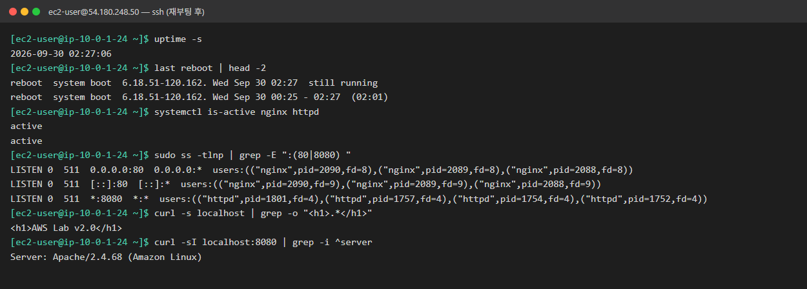

# 04. 야간 점검 후 홈페이지가 이상한 페이지로 바뀜

| 항목 | 내용 |
|---|---|
| 대상 서버 | `linux-ec2` (54.180.248.50, Amazon Linux 2023) |
| 발생 시각 | 2026-09-30 10:10 KST |
| 영향 | 메인 페이지 대신 알 수 없는 테스트 페이지 노출 |
| 상태 | 🟢 해결 (2026-09-30 11:27 KST, 재부팅 검증 완료) |

## 상황

> 운영팀 인수인계 메모:
> "야간 정기 점검으로 nginx를 재시작하려 했는데, `start`에서 실패했습니다. 일단 기록만 남깁니다."
>
> 아침 고객센터 문의:
> "홈페이지에 들어가면 **'It works!'** 한 줄만 나와요. 해킹당한 건가요?"
>
> 개발팀 채팅 (어제 오후):
> "PHP 테스트 좀 해보려고 서버에 이것저것 설치했어요~ 😅"

## 증상

**서버: nginx 시작 실패**



**브라우저: 메인 페이지 (http://54.180.248.50/)**


**내 PC: 응답 헤더**



## 목표

- [x] 원인 찾기: nginx는 왜 못 켜지고, 지금 응답하는 건 누구인지
- [x] 서비스 정상화: 메인 페이지에 "AWS Lab v2.0"이 떠야 함
- [x] **재부팅해도 유지:** 서버를 재부팅해도 nginx가 메인 페이지를 서비스해야 함
- [x] 개발자 배려 (심화): 개발자가 설치한 프로그램을 지우지 말고, nginx와 **함께** 쓸 수 있게 하기
- [x] 재발 방지 정리 (심화)

## 힌트

<details>
<summary>힌트 1: 이 403은 3번 장애와 같은가?</summary>

응답 코드만 보면 3번 시나리오와 같은 403입니다. 하지만 이번에는 응답 헤더의 **`Server:` 줄**이 다릅니다. 3번 때 캡처와 비교해 보세요. 지금 응답하는 프로그램이 누구인가요?
</details>

<details>
<summary>힌트 2: nginx가 못 켜지는 이유</summary>

2번 시나리오에서 쓴 방법 그대로입니다. 실패 메시지가 알려준 `journalctl` 명령으로 nginx가 직접 남긴 `[emerg]` 줄을 찾으세요. 괄호 안의 숫자와 메시지를 보세요.
</details>

<details>
<summary>힌트 3: 포트를 누가 쓰고 있나</summary>

지금 열려 있는(LISTEN) TCP 포트와, 그 포트를 쓰는 프로세스를 보여주는 명령이 있습니다.
```bash
sudo ss -tlnp
```
`-t` TCP, `-l` LISTEN 상태만, `-n` 숫자로 표시, `-p` 프로세스 이름. `:80` 줄을 찾으세요.
</details>

<details>
<summary>힌트 4: 서비스 끄기 (지금 vs 재부팅 후)</summary>

`systemctl`에서 **지금 끄는 것**과 **부팅 때 자동으로 켜지지 않게 하는 것**은 서로 다른 명령입니다. 목표 3을 달성하려면 둘 다 생각해야 합니다. `systemctl is-enabled 서비스명`으로 확인할 수 있습니다.
</details>

<details>
<summary>힌트 5: 함께 쓰기 (심화)</summary>

두 프로그램이 **같은 포트**를 동시에 쓸 수는 없습니다. 한쪽의 포트를 바꾸면 됩니다. Apache의 포트 설정은 `/etc/httpd/conf/httpd.conf`의 `Listen` 줄에 있습니다. 바꾼 뒤에는 Apache도 설정 검사 명령(`apachectl configtest`)이 있습니다.

외부에서 새 포트로 접속하려면 보안 그룹도 열어야 합니다. 서버 안에서 `curl localhost:포트`로만 확인해도 충분합니다.
</details>

## 생각해볼 점

- `Address already in use` 앞의 숫자는 무엇일까요? 1~3번에서 본 에러 번호(28, 13, 2)와 같은 종류일까요?
- "It works!" 페이지는 왜 200이 아니라 403일까요?
- 실무에서는 급할 때 `kill`로 프로세스를 끄기도 합니다. `kill`과 `systemctl stop`은 어떻게 다를까요? 이번 상황에서 `kill`만 했다면 어떤 문제가 생길까요?

## 해결 기록

> 캡처는 장애를 다시 만들지 않고 찍었습니다.
> - 1단계 로그: 서버 journal에 남은 실제 기록입니다. 시각은 UTC입니다.
> - 2단계 `ss`: 조사하면서 실제로 실행한 출력입니다.
> - 3~5단계: 해결 후 서버 상태입니다.
> - 6~7단계: **실제로 재부팅한 뒤** 찍은 화면입니다.

### 작성자 기록

| 항목 | 내용 |
|---|---|
| **원인** | 개발자가 PHP 테스트용으로 설치한 Apache(httpd)가 80번 포트를 먼저 차지함. 야간 점검 때 nginx를 재시작하자 `bind() ... (98: Address already in use)`로 시작 실패. 홈페이지에는 Apache 기본 페이지("It works!")가 노출됨 |
| **확인한 명령어** | `journalctl`로 `bind()` 실패 확인 → `sudo ss -tlnp`로 80번 포트 점유자가 `httpd`임을 확인 → `which`, `rpm -ql`, `dnf history`로 설치 위치와 이력 확인 |
| **조치 내용** | **A. 복구:** `sudo systemctl disable --now httpd`로 httpd를 끄고 자동 시작도 해제한 뒤 `sudo systemctl start nginx`<br>**B. 공존:** `/etc/httpd/conf/httpd.conf`의 `Listen 80` → `Listen 8080`, `apachectl configtest` 확인 후 httpd 다시 활성화 |
| **재발 방지** | 서버에 새 프로그램을 설치하기 전에 사용할 포트를 공유하고 확인(`ss -tlnp`). 설정 변경 전 백업. 변경 후 **재부팅 테스트**로 부팅 시에도 유지되는지 검증 |
| **배운 점** | 로그의 에러(`Address already in use`)는 "누군가 쓰고 있다"까지만 알려주고, **누가** 쓰는지는 `ss`로 직접 확인해야 함. 서비스는 "지금 끄기(stop)"와 "부팅 때 자동 시작 해제(disable)"가 다르다는 것. 같은 403이라도 `Server` 헤더를 보면 응답하는 프로그램이 다를 수 있음 |

### 1단계. 로그: nginx가 못 켜진 이유

```bash
sudo journalctl -u nginx --no-pager | grep bind
```



| 부분 | 뜻 |
|---|---|
| `bind()` | 프로그램이 "이 포트는 내가 쓴다"고 운영체제에 요청하는 동작 |
| `0.0.0.0:80` / `[::]:80` | 모든 IPv4 / IPv6 주소의 80번 포트 |
| `98: Address already in use` | **이미 다른 프로그램이 그 포트를 쓰고 있음** (`EADDRINUSE`) |

같은 줄이 여러 번 찍힌 건 nginx가 포기하기 전에 몇 번 재시도했기 때문입니다.

### 2단계. 포트 점유자 찾기

```bash
sudo ss -tlnp | grep :80
```



| 칸 | 값 | 뜻 |
|---|---|---|
| State | `LISTEN` | 접속을 기다리는 중 |
| Local Address | `*:80` | 모든 IP의 80번 포트 |
| Process | `httpd` pid 4개 | **Apache.** 부모 프로세스 1개 + 요청을 처리하는 자식 프로세스들 (nginx의 master/worker와 같은 구조) |

### 3단계. 정체와 설치 이력 확인

```bash
which httpd                # 실행 파일 위치
rpm -qf /usr/sbin/httpd    # 이 파일은 어느 패키지 소속?
sudo dnf history           # 언제, 무엇을 설치했나
```



- nginx를 설치한 지 **45분 뒤** httpd가 설치됐습니다. 개발자 채팅의 "이것저것 설치했어요"와 시점이 맞습니다.
- `Altered 12`: httpd 하나를 설치했는데 **의존 패키지까지 12개**가 함께 설치됐습니다. 실무에서는 이 목록(`dnf history info 2`)도 확인합니다.

**httpd와 nginx의 파일 위치 비교** (RHEL 계열 공통 규칙: 설정은 `/etc`, 로그는 `/var/log`)

| 용도 | httpd | nginx |
|---|---|---|
| 실행 파일 | `/usr/sbin/httpd` | `/usr/sbin/nginx` |
| 설정 | `/etc/httpd/conf/httpd.conf` | `/etc/nginx/nginx.conf` |
| 추가 설정 | `/etc/httpd/conf.d/` | `/etc/nginx/conf.d/` |
| 웹 파일 | `/var/www/html/` | `/usr/share/nginx/html/` |
| 로그 | `/var/log/httpd/` | `/var/log/nginx/` |

### 4단계. 조치

**A. 서비스 복구 (먼저)**
```bash
sudo systemctl disable --now httpd   # 지금 끄기 + 부팅 시 자동 시작 해제
sudo systemctl start nginx
```

**B. 둘 다 살리기 (심화)**
```bash
sudo nano /etc/httpd/conf/httpd.conf  # Listen 80 → Listen 8080
sudo apachectl configtest             # Syntax OK 확인 후 적용
sudo systemctl enable --now httpd     # 8080으로 다시 켜기 + 자동 시작
```



| systemctl 명령 | 지금 | 재부팅 후 |
|---|---|---|
| `stop` | 꺼짐 | enabled면 **다시 켜짐** |
| `disable` | 그대로 | 안 켜짐 |
| `disable --now` | 꺼짐 | 안 켜짐 |
| `enable --now` | 켜짐 | 켜짐 |

> ⚠️ 서비스 하나를 끄는 것(`systemctl stop httpd`)과 **서버 전체를 끄는 것**(`systemctl poweroff`, `shutdown`)은 다릅니다. 헷갈리면 SSH가 끊기고 EC2가 중지됩니다.

### 5단계. 공존 확인

```bash
sudo ss -tlnp | grep -E ":(80|8080) "
curl -s localhost | grep -o "<h1>.*</h1>"     # nginx (80)
curl -sI localhost:8080 | grep -i ^server      # Apache (8080)
```



### 6단계. 재부팅 검증

설정만 보고 "재부팅해도 괜찮을 것"이라고 판단하지 않고, **실제로 재부팅해서 확인**했습니다.

```bash
sudo systemctl reboot
# 재접속 후
uptime -s                          # 부팅 시각이 바뀌었는지 (재부팅이 실제로 됐는지)
last reboot | head -2
systemctl is-active nginx httpd
sudo ss -tlnp | grep -E ":(80|8080) "
```



- 부팅 시각: 00:25 → **02:27**. 재부팅이 실제로 일어났습니다.
- 두 서비스 모두 자동으로 켜졌습니다(`active`).
- **pid를 보면 httpd(1752)가 nginx(2088)보다 먼저 켜졌습니다.** 그래도 포트가 달라서 충돌하지 않았습니다. 만약 httpd가 여전히 80번이었다면 부팅할 때마다 **먼저 켜진 쪽이 80번을 차지해서** 장애가 되풀이됐을 겁니다.

### 7단계. 외부 접속 확인


### 리뷰: 실무라면 더 챙길 점

- **설정 백업:** `httpd.conf`를 수정하기 전에 백업(`.bak`)을 만들지 않았습니다. 한 줄 수정이라 문제는 없었지만, 2번에서 정리한 "수정 전 백업" 습관을 이어가면 좋습니다.
- **외부 노출 확인:** 8080은 보안 그룹에 열려 있지 않아서 외부에서 접속할 수 없습니다. 개발자가 외부에서 테스트해야 한다면, 보안 그룹(Terraform)에 **내 IP만** 8080을 허용하는 규칙을 추가합니다.
- **공유:** 개발팀에 "Apache는 8080으로 옮겼다"고 알려야 합니다. 말없이 바꾸면 개발자 쪽에서 새 장애가 생깁니다.

### 생각해볼 점: 답

- **98의 의미:** 리눅스 에러 번호 `EADDRINUSE`(Address already in use)입니다. 1~3번의 28(`ENOSPC`), 13(`EACCES`), 2(`ENOENT`)와 같은 종류입니다.
- **"It works!"가 403인 이유:** Apache의 기본 환영 페이지는 "아직 실제 웹 콘텐츠가 없다"는 뜻으로 일부러 403을 돌려줍니다(`/etc/httpd/conf.d/welcome.conf`). 응답 코드만 보면 3번 권한 문제와 같지만, **`Server` 헤더**를 보면 nginx가 아니라 Apache가 응답하고 있다는 걸 알 수 있습니다.
- **`kill`과 `systemctl stop`의 차이:** `kill`은 프로세스만 강제로 끝내고, systemd는 이걸 "비정상 종료"로 볼 수 있습니다. 서비스 설정에 따라 **자동으로 다시 켜질 수도** 있고, 부팅 설정(`enabled`)도 그대로 남아서 **재부팅하면 다시 80번을 차지합니다.** systemd로 관리되는 서비스는 `systemctl`로 끄는 게 원칙입니다.
