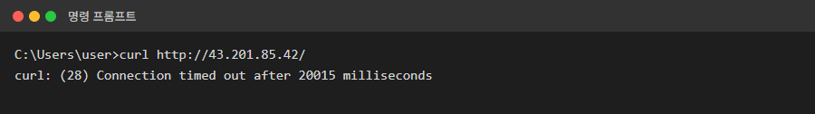
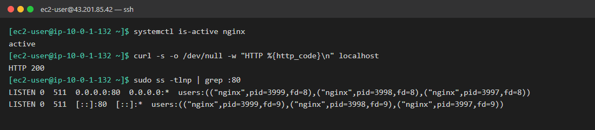
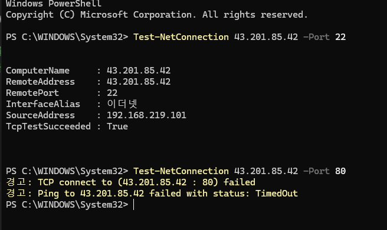
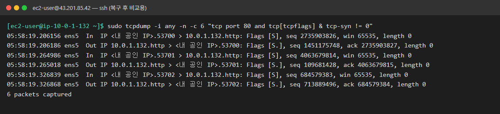
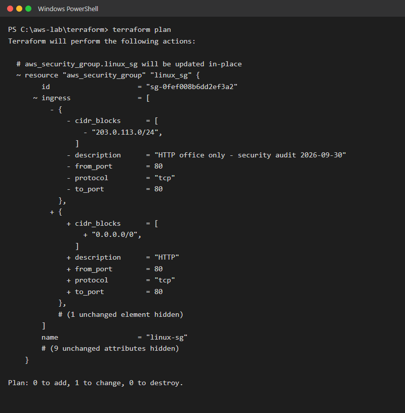
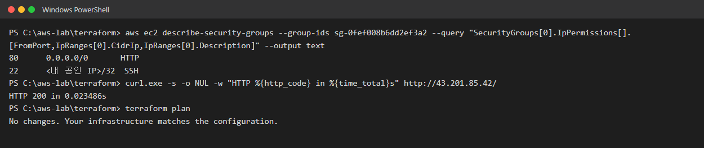
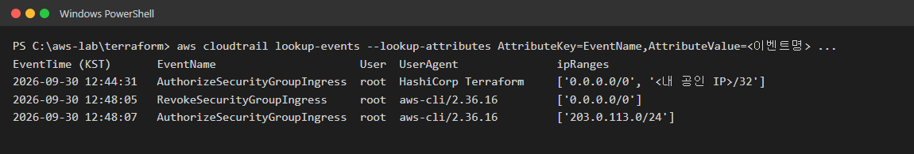

# 05. 서버는 정상인데 외부에서 접속 불가

| 항목 | 내용 |
|---|---|
| 대상 서버 | `linux-ec2` (43.201.85.42, Amazon Linux 2023) |
| 발생 시각 | 2026-09-30 12:48 KST (CloudTrail 기록 기준) |
| 영향 | 외부에서 웹사이트 접속 불가 (타임아웃) |
| 상태 | 🟢 해결 (2026-09-30 14:56 KST, Terraform으로 복구, CloudTrail 기록 기준) |

## 상황

> 고객센터 문의:
> "홈페이지가 한참 로딩만 하다가 결국 안 열려요."
>
> 서버 담당자 답변:
> "서버 들어가 봤는데 nginx 잘 떠 있고, 서버 안에서 접속하면 200 나와요. **서버는 아무 문제 없어요.**"
>
> 보안팀 공지 (오늘 오전):
> "금일 클라우드 보안 점검을 진행했습니다. 불필요하게 열린 접근 권한을 일부 정리했습니다."

## 증상

**내 PC: 응답 없이 시간 초과**



**서버 안: nginx 정상**



## 목표

- [x] 문제 위치 좁히기: 서버 **안**의 문제인지, 서버 **밖**(네트워크)의 문제인지 증거로 판단
- [x] 원인 찾기: 무엇이 언제 바뀌었는지
- [x] 서비스 정상화: 내 PC에서 http://43.201.85.42 가 열려야 함
- [x] **Terraform으로 복구하기:** AWS 콘솔에서 손으로 되돌리지 말고, 코드와 실제 상태의 차이(drift)를 확인한 뒤 Terraform으로 복구. 콘솔에서 고치면 절반만 성공
- [x] 재발 방지 정리 (심화)

## 힌트

<details>
<summary>힌트 1: 2번 장애 때와 에러가 다르다</summary>

2번 시나리오의 캡처(`images/02-config-local.png`)와 비교해 보세요. 그때도 접속이 안 됐지만 에러 메시지와 **실패까지 걸린 시간**이 다릅니다.
- 금방 실패: 서버까지는 도착했는데 **받아줄 프로그램이 없음**
- 한참 기다리다 실패: 요청이 **중간 어딘가에서 사라짐**
</details>

<details>
<summary>힌트 2: 요청이 지나가는 길 그려보기</summary>

```
내 PC → 인터넷 → IGW → 보안 그룹 → EC2(리눅스) → nginx
```
서버 안에서 `curl localhost`가 되면 **EC2 → nginx** 구간은 정상입니다. SSH(22번)도 되는데 HTTP(80번)만 안 된다면, **포트별로 통과 여부를 정하는 곳**은 어디일까요?
</details>

<details>
<summary>힌트 3: 보안 그룹 확인</summary>

AWS 콘솔 → EC2 → 보안 그룹 → `linux-sg` → 인바운드 규칙을 보세요. 또는 CLI로 확인합니다.
```bash
aws ec2 describe-security-groups --region ap-northeast-2 --filters Name=group-name,Values=linux-sg --query "SecurityGroups[0].IpPermissions"
```
Terraform 코드(`security_group.tf`)와 비교해 보세요.
</details>

<details>
<summary>힌트 4: Terraform에게 물어보기</summary>

Terraform은 **코드에 적힌 상태**와 **AWS의 실제 상태**를 비교할 수 있습니다. 아무것도 바꾸지 않고 비교만 하는 명령이 있습니다. 그 결과에 `~`(변경)가 나오면 누군가 Terraform 밖에서 바꿨다는 뜻입니다.
</details>

<details>
<summary>힌트 5: 누가 바꿨나 (심화)</summary>

AWS의 모든 API 호출은 **CloudTrail**에 기록됩니다. 콘솔 → CloudTrail → 이벤트 기록에서 이벤트 이름 `RevokeSecurityGroupIngress`로 필터링해 보세요.
</details>

## 생각해볼 점

- `Connection timed out`과 `Connection refused`는 각각 어느 구간의 문제를 뜻할까요?
- 보안 그룹에서 막힌 요청에는 왜 "거부" 응답이 오지 않고 타임아웃이 날까요?
- 콘솔에서 규칙을 손으로 되돌리면 당장은 해결됩니다. 그런데 왜 Terraform으로 복구해야 할까요? 반대로 보안팀의 변경이 **옳은 결정**이었다면 어떻게 해야 할까요?

## 해결 기록

> 캡처 출처
> - 1단계: 조사하면서 직접 찍은 화면입니다.
> - 2단계 tcpdump: 장애 중에는 패킷이 **하나도 찍히지 않았습니다.** 그 화면은 남기지 못해서, 비교용으로 **복구 후** 패킷이 도착하는 화면을 찍었습니다.
> - 3단계 plan: 장애 중에 실제로 실행한 출력입니다. 변경과 관계없는 줄 일부는 생략했습니다.
> - 4~5단계: 실제 출력을 보기 좋게 정리했습니다.
> - 공개 저장소라서 내 공인 IP는 `<내 공인 IP>`로 가렸습니다.

### 작성자 기록

| 항목 | 내용 |
|---|---|
| **원인** | 보안 점검 중 `linux-sg`의 HTTP(80) 인바운드 규칙이 Terraform 밖(AWS CLI)에서 `0.0.0.0/0` → `203.0.113.0/24`(사무실 대역)으로 바뀜. 외부 요청이 보안 그룹에서 버려져서 타임아웃 발생 |
| **확인한 명령어** | `Test-NetConnection`으로 22번은 성공, 80번만 실패 확인 → 서버에서 `tcpdump`로 80번 패킷이 도착하지 않음 확인 → `terraform plan`으로 drift(코드와 실제 상태의 차이) 확인 → CloudTrail로 변경 시각과 도구 확인 |
| **조치 내용** | 코드(`security_group.tf`)는 수정하지 않고 `terraform apply`로 AWS를 코드 상태로 되돌림 → `plan` 재실행으로 `No changes` 확인 |
| **재발 방지** | ① 정기 drift 감지: CI에서 `terraform plan -detailed-exitcode`를 매일 실행하고 차이가 있으면 알림 ② IAM으로 콘솔, CLI의 보안 그룹 수정 권한을 제한하고 **코드(PR)로만 변경** ③ 보안 정책을 바꿔야 할 때는 되돌리지 말고 코드를 고쳐서 반영 |
| **배운 점** | 서버 안이 정상이면 **요청이 지나가는 길을 구간별로** 나눠서 확인해야 함. 에러가 없다는 것이 아니라 **패킷이 도착하지 않았다**는 것이 증거. 인프라는 코드와 같아야 하고, `plan`으로 차이를 확인할 수 있음 |

### 1단계. 포트별로 비교하기

```powershell
Test-NetConnection 43.201.85.42 -Port 22
Test-NetConnection 43.201.85.42 -Port 80
```



- 22번 `TcpTestSucceeded : True`: 서버는 켜져 있고 네트워크로 연결됨
- 80번 `TCP connect ... failed`: **80번만** 막힘
- `Ping ... TimedOut`은 **증거가 아닙니다.** 이 보안 그룹은 처음부터 ping(ICMP)을 허용하지 않아서 22번 테스트에서도 ping은 실패합니다.

### 2단계. 요청이 서버에 도착하나?

```bash
sudo tcpdump -i any -n port 80     # 이 상태로 두고 내 PC에서 접속
```

| 장애 중 | 복구 후 (아래 캡처) |
|---|---|
| 접속해도 **아무 줄도 찍히지 않음** → 요청이 서버에 오기 **전에** 사라짐 | `In` (내 PC → 서버) `Flags [S]`와 `Out` (서버 → 내 PC) `Flags [S.]`가 찍힘 → 요청이 도착하고 서버가 응답함 |



> 💡 `Flags [S]`는 TCP 연결 요청(SYN), `[S.]`는 서버의 수락 응답(SYN-ACK)입니다. 캡처에서는 보기 좋게 연결 시작 패킷만 필터링했습니다.

**지금까지의 증거로 좁힌 결론**
| 증거 | 결과 | 결론 |
|---|---|---|
| 서버 안 `curl localhost` | 200 | nginx 정상 |
| 22번 연결 | 성공 | 서버, IGW, 라우팅 정상 |
| 80번 연결 | 실패 (타임아웃) | 80번만 막힘 |
| `tcpdump port 80` | 패킷 없음 | 서버에 도착하기 **전** |

→ **서버 밖**에서 **포트별로** 통과를 정하는 곳, 즉 **보안 그룹**을 의심합니다.

### 3단계. Terraform으로 drift 확인

```powershell
cd c:\aws-lab\terraform
terraform plan
```



| 기호 | 뜻 | 이번 결과 |
|---|---|---|
| `-` | AWS에는 있지만 코드에는 없음 → apply하면 **삭제** | `203.0.113.0/24` (security audit) |
| `+` | 코드에는 있지만 AWS에 없음 → apply하면 **추가** | `0.0.0.0/0` (HTTP) |
| `# (1 unchanged element hidden)` | 변경 없음 | SSH 22번 규칙 |

`plan`은 아무것도 바꾸지 않고 **비교만** 합니다. 누가 Terraform 밖에서 바꾼 게 있으면 이렇게 드러납니다.

### 4단계. Terraform으로 복구

```powershell
terraform apply      # 변경 목록이 plan과 같은지 확인 후 yes
terraform plan       # No changes 확인
```



- 80번 `0.0.0.0/0` 복구, 22번은 그대로
- 외부 접속 **HTTP 200**, 0.02초 (장애 중에는 20초 타임아웃)
- `No changes. Your infrastructure matches the configuration.` → 코드와 실제가 다시 일치

**코드를 한 줄도 고치지 않았습니다.** 코드에는 이미 "80번은 `0.0.0.0/0`"이라는 **원하는 상태**가 적혀 있고, Terraform은 실제 상태를 거기에 맞춥니다(선언형).

### 5단계. 누가, 언제 바꿨나 (CloudTrail)

```powershell
aws cloudtrail lookup-events --lookup-attributes AttributeKey=EventName,AttributeValue=RevokeSecurityGroupIngress
aws cloudtrail lookup-events --lookup-attributes AttributeKey=EventName,AttributeValue=AuthorizeSecurityGroupIngress
```



- **12:44** Terraform(`HashiCorp Terraform`)이 apply로 규칙 생성
- **12:48:05** `aws-cli`로 `0.0.0.0/0` 삭제(Revoke) → 장애 시작 시각
- **12:48:07** `aws-cli`로 `203.0.113.0/24` 추가(Authorize)
- **14:56:43** Terraform이 `203.0.113.0/24` 삭제 → 복구 시각 (캡처 이후에 CloudTrail에 반영되어 이미지에는 없음)
- **UserAgent**를 보면 Terraform으로 바꿨는지, 사람이 CLI나 콘솔로 바꿨는지 구분됩니다.

> ⚠️ **발견한 보안 문제:** 모든 작업의 사용자가 `root`입니다. root 계정의 액세스 키를 쓰고 있어서 **누가 바꿨는지 사람 단위로 구분할 수 없습니다.** 실무라면 IAM 사용자나 IAM Identity Center(SSO)로 사람마다 계정을 나누고, root 액세스 키는 삭제해야 합니다. 이 저장소의 개선 과제로 남깁니다.

> 이 실습에서 12:48의 변경은 보안팀 역할로 Claude Code가 AWS CLI로 재현한 것입니다.

### 생각해볼 점: 답

- **timeout vs refused:**
  | 에러 | 뜻 | 이번 실습 |
  |---|---|---|
  | `Connection refused` (금방 실패) | 서버에 **도착했지만** 그 포트에 프로그램이 없음 → 서버가 "거부" 응답 | 2번: nginx가 꺼져 있었음 (2초 만에 실패) |
  | `Connection timed out` (한참 뒤 실패) | 요청이 **중간에서 버려짐**, 응답이 오지 않음 | 5번: 보안 그룹에서 차단 (20초 뒤 실패) |
- **보안 그룹은 왜 거부 응답을 안 보내나:** 보안 그룹은 허용 목록(allow)만 있고, 목록에 없는 요청은 **조용히 버립니다(drop).** 거부 응답을 보내면 공격자에게 "여기 서버가 있다"는 정보를 주게 되기 때문입니다.
- **왜 Terraform으로 복구해야 하나:** 콘솔에서 손으로 고치면 당장은 해결되지만, 어떤 값이 정답인지 기준이 사라집니다. 코드가 **유일한 기준(Single Source of Truth)**이어야, 누가 무엇을 언제 바꿨는지 Git 기록으로 남고, 다음 apply 때 설정이 뜻하지 않게 되돌아가는 일이 없습니다.
- **보안팀 변경이 옳았다면:** 되돌리면 안 됩니다. `security_group.tf`의 80번 `cidr_blocks`를 새 정책에 맞게 **코드로 수정** → PR, 리뷰 → `plan` → `apply` 순서로 반영합니다. 결과는 같아도 **변경 경로가 코드를 거치는 것**이 핵심입니다.
