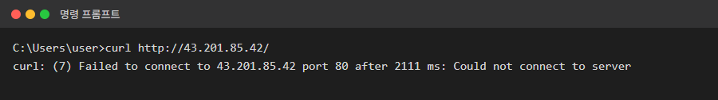
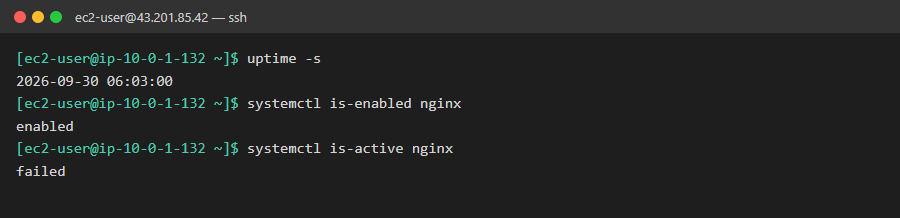
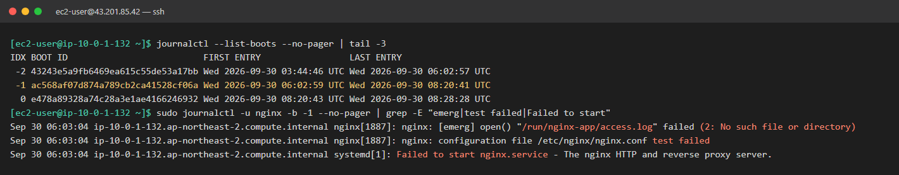
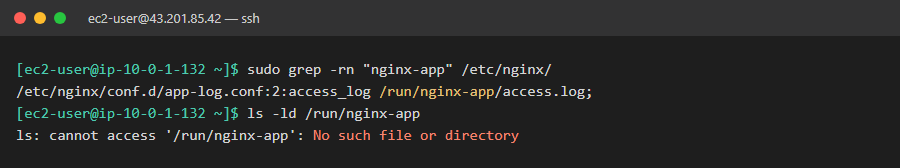
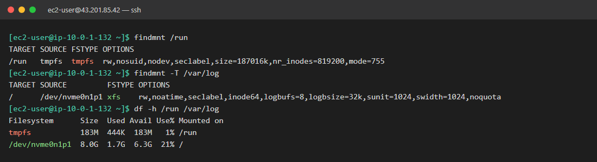
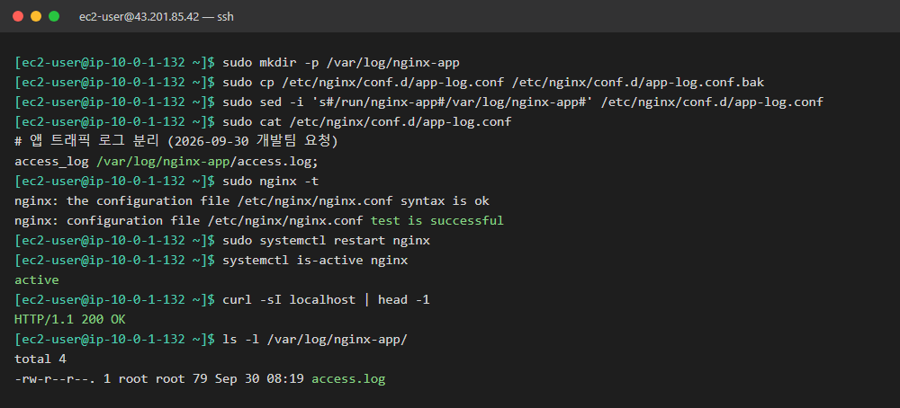
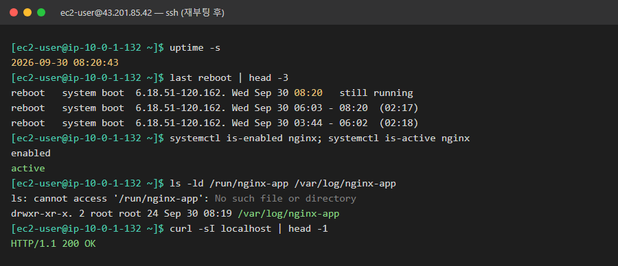
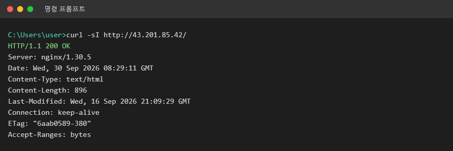

# 06. 정기 재부팅 후 웹 서버가 켜지지 않음

| 항목 | 내용 |
|---|---|
| 대상 서버 | `linux-ec2` (43.201.85.42, Amazon Linux 2023) |
| 발생 시각 | 2026-09-30 15:03 KST (재부팅 시각) |
| 영향 | 웹사이트 전체 접속 불가 |
| 상태 | 🟢 해결 (2026-09-30 17:19 KST 복구, 17:20 재부팅 검증) |

## 상황

> 운영팀 공지 (오늘 오후):
> "보안 패치 적용을 위해 15:00에 서버를 정기 재부팅합니다."
>
> 재부팅 직후 모니터링 알림:
> "🚨 http://43.201.85.42 응답 없음"
>
> 개발팀 채팅 (재부팅 전):
> "앱 트래픽만 따로 보려고 nginx 접속 로그를 별도 폴더로 분리했어요. `nginx -t` 통과했고, reload 후에 로그 잘 쌓이는 것까지 확인했어요! 👍"

## 증상

**내 PC: 접속 불가**



**서버: 자동 시작은 켜져 있는데 실행 실패**



## 목표

- [x] 원인 찾기: 재부팅 **전에는** 잘 되던 설정이 왜 재부팅 **후에는** 실패하는지
- [x] 서비스 정상화: http://43.201.85.42 가 열려야 함
- [x] **재부팅해도 유지:** 고친 뒤 **실제로 재부팅**해서 nginx가 자동으로 켜지는지 확인. 당장만 살리고 다음 재부팅 때 또 죽으면 절반만 성공
- [x] 개발팀 요구 유지: 앱 로그를 **별도 파일로 분리**한다는 개발팀의 목적은 살리기
- [x] 재발 방지 정리 (심화)

## 힌트

<details>
<summary>힌트 1: 4번 장애와 무엇이 다른가</summary>

4번에서는 "부팅 때 자동으로 켜지는가(`is-enabled`)"가 문제였습니다. 이번에는 `enabled`인데도 `failed`입니다. 즉 systemd는 **켜려고 시도했지만 실패**했습니다. 실패 이유는 2번 시나리오에서 쓴 방법으로 찾을 수 있습니다.
</details>

<details>
<summary>힌트 2: 에러 메시지의 번호</summary>

로그에서 nginx가 남긴 `[emerg]` 줄의 괄호 안 번호를 보세요. 1~5번에서 본 에러 번호(28, 13, 2, 98) 중 하나입니다. 그 번호가 무슨 뜻이었는지 떠올려 보세요.
</details>

<details>
<summary>힌트 3: 어제는 있었는데 오늘은 없다</summary>

개발자는 분명히 폴더를 만들고 확인까지 했습니다. 그런데 지금은 없습니다. 그 폴더가 **어떤 종류의 저장 공간**에 있는지 확인해 보세요.
```bash
df -h <폴더의 상위 경로>
findmnt <폴더의 상위 경로>
```
`Filesystem`이나 `FSTYPE` 칸에 나오는 이름이 무엇을 뜻하는지 찾아보세요.
</details>

<details>
<summary>힌트 4: 제대로 고치는 방법</summary>

방법은 여러 가지가 있습니다. 하나를 골라 보세요.
1. 로그를 **재부팅해도 사라지지 않는 곳**으로 옮기기 (다른 nginx 로그는 어디에 있나요?)
2. 부팅할 때마다 폴더를 **자동으로 만들어 주는** 기능 쓰기: `man tmpfiles.d`

2번을 고른다면, 설정 파일을 만든 뒤 재부팅하지 않고 바로 적용해 볼 수 있습니다: `sudo systemd-tmpfiles --create <설정 파일 경로>`. 이 서버의 systemd(252)에는 `--dry-run` 옵션이 없습니다.
</details>

<details>
<summary>힌트 5: 재부팅 검증</summary>

4번 문서의 "6단계. 재부팅 검증"을 참고하세요. `uptime -s`로 재부팅이 실제로 일어났는지 먼저 확인합니다.
</details>

## 생각해볼 점

- 개발자는 `nginx -t`도 통과시키고 reload 후 확인까지 했습니다. 그런데도 장애가 났습니다. **무엇을 확인하지 않았기 때문**일까요?
- `/run`, `/tmp`, `/var/log`, `/var/lib`는 각각 어떤 용도일까요? 이 중 재부팅하면 사라지는 곳은?
- 이번 에러(`Could not connect`, 2초 만에 실패)는 5번(`timed out`, 20초 뒤 실패)과 다릅니다. 이 차이만 보고도 원인이 서버 안인지 밖인지 알 수 있을까요?

## 해결 기록

> 캡처 출처
> - 1단계 로그: 서버 journal에 남은 **실패한 부팅(06:03 UTC)의 실제 기록**입니다. 서버 시각은 UTC라서 한국 시각(KST)보다 9시간 느립니다.
> - 2단계: `grep` 결과는 조사하면서 실제로 실행한 출력입니다.
> - 3~4단계: 실제로 실행한 출력입니다.
> - 5~6단계: **실제로 재부팅한 뒤** 찍은 화면입니다.
> - 모든 캡처는 실제 출력을 보기 좋게 정리했고, 중요한 부분에 색을 입혔습니다.

### 작성자 기록

| 항목 | 내용 |
|---|---|
| **원인** | 개발팀이 앱 접속 로그를 `/run/nginx-app/access.log`로 분리함. `/run`은 **메모리에 있는 임시 파일시스템(tmpfs)**이라서 재부팅하면 비워짐. 재부팅 후 `/run/nginx-app` 폴더가 사라졌고, nginx가 로그 파일을 열지 못해 `(2: No such file or directory)`로 시작 실패 |
| **확인한 명령어** | `systemctl is-enabled`/`is-active`로 "켜려고 했지만 실패"를 확인 → `journalctl -u nginx -b -1`로 이전 부팅의 `[emerg]` 로그 확인 → `grep -rn`으로 설정 위치(`conf.d/app-log.conf`) 확인 → `findmnt`, `df`로 `/run`이 tmpfs임을 확인 |
| **조치 내용** | 설정 백업(`.bak`) 후 로그 경로를 디스크에 있는 `/var/log/nginx-app/access.log`로 변경 → `nginx -t` → `restart` → 서버 안, 밖에서 200 확인 → **실제 재부팅**해서 자동 기동 확인 |
| **재발 방지** | ① 로그처럼 **남아야 하는 데이터는 `/var/log`**, `/run`은 실행 중에만 필요한 파일(PID, 소켓)용 ② 부팅 관련 설정(서비스, 경로, 마운트)을 바꾸면 **재부팅 테스트까지** 해야 완료 ③ 로그 폴더를 새로 만들면 logrotate 설정도 함께 추가 |
| **배운 점** | `nginx -t` 통과는 "**지금 이 순간** 설정이 맞다"는 뜻일 뿐, 재부팅 후에도 맞다는 보장이 아님. 폴더를 만들었다고 끝이 아니라 그 폴더가 **어떤 저장 공간에 있는지**까지 확인해야 함 |

**타임라인 (KST)**

| 시각 | 일 |
|---|---|
| 재부팅 전 | 개발팀이 `/run/nginx-app` 폴더를 만들고 로그 경로 변경. `nginx -t`, reload, 로그 확인까지 정상 |
| 15:03 | 정기 재부팅. `/run`이 비워져 nginx 시작 실패 → **장애 시작** |
| 17:19 | 로그 경로를 `/var/log/nginx-app`로 옮기고 nginx 재시작 → **복구** |
| 17:20 | 실제 재부팅 → nginx 자동 기동 확인 → **해결 확인** |

### 한눈에 보기: 왜 재부팅 전에는 되고, 후에는 안 됐나

```
[재부팅 전]
  개발자: mkdir /run/nginx-app  →  폴더 있음  →  nginx -t 통과 ✅  →  로그 잘 쌓임 ✅

[재부팅]
  /run 은 메모리(RAM)에 있음  →  전원이 꺼지면 내용이 전부 사라짐
                                   └─ /run/nginx-app 폴더도 같이 사라짐

[재부팅 후]
  systemd: "nginx 켜야지" (enabled)
    └─ nginx: "/run/nginx-app/access.log 열어야지"
         └─ 폴더가 없음 → (2: No such file or directory) → 시작 실패 ❌
```

비유하면 `/run`은 **화이트보드**, `/var/log`는 **공책**입니다. 화이트보드에 적은 메모는 퇴근할 때(재부팅) 지워집니다. 오래 남겨야 하는 로그는 공책에 써야 합니다.

### 1단계. 로그: 부팅 때 nginx가 왜 실패했나

`enabled`인데 `failed`라는 건 systemd가 **켜려고 시도했지만 실패**했다는 뜻입니다. 실패한 건 지난번 부팅 때라서, 지금 부팅이 아니라 **이전 부팅(`-b -1`)**의 로그를 봐야 합니다.

```bash
journalctl --list-boots --no-pager | tail -3        # 부팅 번호 목록
sudo journalctl -u nginx -b -1 --no-pager | grep -E "emerg|test failed|Failed to start"
```



| 부분 | 뜻 |
|---|---|
| `-b -1` | 바로 이전 부팅. `0`은 지금 부팅, `-1`은 그 전, `-2`는 그 전전 |
| `open() "/run/nginx-app/access.log" failed` | nginx가 로그 파일을 열지 못함 |
| `(2: No such file or directory)` | 에러 번호 2 = `ENOENT`. **파일이나 폴더가 없음** (2번 시나리오와 같은 번호) |
| `test failed` | nginx는 켜기 전에 스스로 설정 검사(`nginx -t`)를 하는데, 그 검사에서 실패 |

> 💡 nginx는 로그 **파일**이 없으면 알아서 만들지만, 그 파일이 들어갈 **폴더**는 만들지 않습니다. 그래서 폴더가 없으면 시작 자체가 실패합니다.

### 2단계. 설정 위치와 폴더 확인

```bash
sudo grep -rn "nginx-app" /etc/nginx/     # 이 경로가 어느 설정 파일에 있나
ls -ld /run/nginx-app                     # 폴더가 정말 없나
```



- 설정은 `/etc/nginx/conf.d/app-log.conf`의 2번째 줄에 있었습니다.
- 개발자가 **분명히 만들었던 폴더**가 지금은 없습니다. 누가 지운 걸까요?

### 3단계. 폴더가 사라진 이유: `/run`은 메모리

```bash
findmnt /run              # /run 은 어떤 저장 공간인가
findmnt -T /var/log       # /var/log 는? (-T: 이 경로가 속한 마운트를 찾아줌)
df -h /run /var/log
```



| 경로 | FSTYPE | 실제 위치 | 재부팅하면 |
|---|---|---|---|
| `/run` | `tmpfs` | **메모리(RAM)** | **비워짐** |
| `/var/log` (`/`에 속함) | `xfs` | 디스크(EBS, `/dev/nvme0n1p1`) | 남아 있음 |

**아무도 지우지 않았습니다.** `tmpfs`는 메모리에 만든 임시 파일시스템이라, 전원이 꺼지면 내용이 원래 사라집니다. `/run`은 "지금 실행 중인 프로그램"에 대한 정보(PID 파일, 소켓)를 두는 곳이라, 재부팅 때 비워지는 게 **정상 동작**입니다.

### 4단계. 조치: 로그를 디스크(`/var/log`)로 옮기기

힌트 4의 두 방법 중 **1번(재부팅해도 사라지지 않는 곳으로 옮기기)**을 골랐습니다. 로그는 나중에 다시 봐야 하는 데이터라서, 재부팅할 때마다 지워지는 곳에 두면 안 되기 때문입니다.

```bash
sudo mkdir -p /var/log/nginx-app                                               # 새 폴더
sudo cp /etc/nginx/conf.d/app-log.conf /etc/nginx/conf.d/app-log.conf.bak      # 백업
sudo sed -i 's#/run/nginx-app#/var/log/nginx-app#' /etc/nginx/conf.d/app-log.conf   # 경로 변경
sudo cat /etc/nginx/conf.d/app-log.conf
sudo nginx -t && sudo systemctl restart nginx
systemctl is-active nginx
curl -sI localhost | head -1
ls -l /var/log/nginx-app/
```



- `sed`의 `s#찾을말#바꿀말#`: 경로에 `/`가 들어 있어서, 구분자로 `/` 대신 `#`을 썼습니다.
- 백업 파일 `app-log.conf.bak`는 `conf.d`에 그대로 둬도 됩니다. nginx는 `*.conf`로 끝나는 파일만 읽기 때문입니다(`nginx.conf`의 `include /etc/nginx/conf.d/*.conf;`).
- 새 경로에 `access.log`가 생겼습니다. 앱 로그를 **별도 파일로 분리**한다는 개발팀의 목적은 그대로 살렸습니다.

> 💡 `mkdir`, `sed` 같은 명령은 셸에서 실행하지만, `access_log`는 **nginx 설정 파일 안에 적는 지시어**라서 셸에서 실행하면 `command not found`가 납니다.

### 5단계. 재부팅 검증

이번 장애는 **재부팅해야 드러나는** 문제였습니다. 그래서 고친 것도 재부팅해서 확인해야 끝납니다. 개발자가 놓친 게 바로 이 단계입니다.

```bash
sudo reboot
# 1~2분 후 재접속
uptime -s                                   # 부팅 시각이 바뀌었나 (재부팅이 실제로 됐나)
last reboot | head -3
systemctl is-enabled nginx; systemctl is-active nginx
ls -ld /run/nginx-app /var/log/nginx-app
curl -sI localhost | head -1
```



- 부팅 시각: 06:03 → **08:20** (UTC). 재부팅이 실제로 일어났습니다.
- nginx가 **자동으로** 켜졌습니다(`active`).
- `/run/nginx-app`은 재부팅하면서 **또 사라졌지만**, 이제 아무도 그 폴더를 쓰지 않아서 문제가 없습니다. `/var/log/nginx-app`은 그대로 남아 있습니다.

### 6단계. 외부 접속 확인

```cmd
curl -sI http://43.201.85.42/
```



장애 때는 2초 만에 `Could not connect`였는데, 이제 `200 OK`가 옵니다.

### 다른 방법: `/run`을 계속 쓰고 싶다면 (tmpfiles.d)

이번에는 쓰지 않았지만, `/run` 아래 폴더가 꼭 필요한 경우(예: 소켓 파일)에는 **부팅할 때마다 systemd가 폴더를 다시 만들게** 할 수 있습니다.

```bash
# /etc/tmpfiles.d/nginx-app.conf
# 종류 경로             권한  소유자 그룹
d      /run/nginx-app   0755  root   root
```
```bash
sudo systemd-tmpfiles --create /etc/tmpfiles.d/nginx-app.conf   # 재부팅 없이 바로 적용
```

| 방법 | 장점 | 단점 |
|---|---|---|
| **`/var/log`로 옮기기 (선택)** | 로그가 재부팅 후에도 남음. 리눅스 표준 위치 | 경로가 바뀌어서 개발팀에 공유해야 함 |
| tmpfiles.d로 폴더 자동 생성 | 경로를 안 바꿔도 됨 | **로그는 여전히 재부팅마다 사라짐**. 메모리를 차지함 |

로그는 장애가 났을 때 **"그때 무슨 일이 있었나"**를 보려고 남기는 것입니다. 재부팅하면 사라지는 로그는 제 역할을 못 하기 때문에 1번을 골랐습니다.

### 리뷰: 실무라면 더 챙길 점

- **logrotate:** 새 로그 폴더를 만들면 로그가 계속 쌓입니다. 1번 시나리오(디스크 가득 참)를 되풀이하지 않으려면 `/etc/logrotate.d/nginx`에 `/var/log/nginx-app/*.log`도 추가해야 합니다.
- **로그 중복:** `nginx.conf`에도 `access_log /var/log/nginx/access.log main;`이 있어서, 지금은 같은 요청이 **두 파일에 모두** 기록됩니다. 앱 트래픽만 따로 보고 싶다는 목적이라면, 앱 경로(`location`)에만 `access_log`를 두는 방식으로 개발팀과 다시 정리하면 좋습니다.
- **공유:** 로그 위치가 `/run/nginx-app`에서 `/var/log/nginx-app`으로 바뀌었다고 개발팀에 알려야 합니다.

### 생각해볼 점: 답

- **개발자가 확인하지 않은 것:** **재부팅 후에도 되는지**를 확인하지 않았습니다. `nginx -t`는 "지금 이 순간 폴더가 있고 문법이 맞는지"만 봅니다. 폴더가 재부팅 때 사라질지는 알려주지 않습니다. 부팅과 관련된 변경은 재부팅 테스트까지 해야 합니다.
- **`/run`, `/tmp`, `/var/log`, `/var/lib`의 용도:**

  | 경로 | 용도 | 재부팅하면 |
  |---|---|---|
  | `/run` | 실행 중인 프로그램 정보 (PID, 소켓) | **사라짐** (tmpfs) |
  | `/tmp` | 잠깐 쓰는 임시 파일 | **사라짐** (Amazon Linux 2023은 tmpfs) |
  | `/var/log` | 로그 | 남음 |
  | `/var/lib` | 프로그램이 저장하는 데이터 (DB 파일 등) | 남음 |

- **에러 메시지만 보고 서버 안인지 밖인지 알 수 있나:** 알 수 있습니다.

  | 에러 | 걸린 시간 | 뜻 | 원인 위치 |
  |---|---|---|---|
  | `Could not connect` (이번, 6번) | 2초 | 서버까지 도착했지만 80번 포트에 **받는 프로그램이 없음** → 서버가 바로 거부 | **서버 안** (nginx 꺼짐) |
  | `timed out` (5번) | 20초 | 요청이 **중간에서 버려져** 응답이 없음 | **서버 밖** (보안 그룹) |

  그래서 이번에는 보안 그룹 같은 네트워크 쪽을 볼 필요 없이 바로 서버 안의 nginx 상태부터 확인했습니다.
